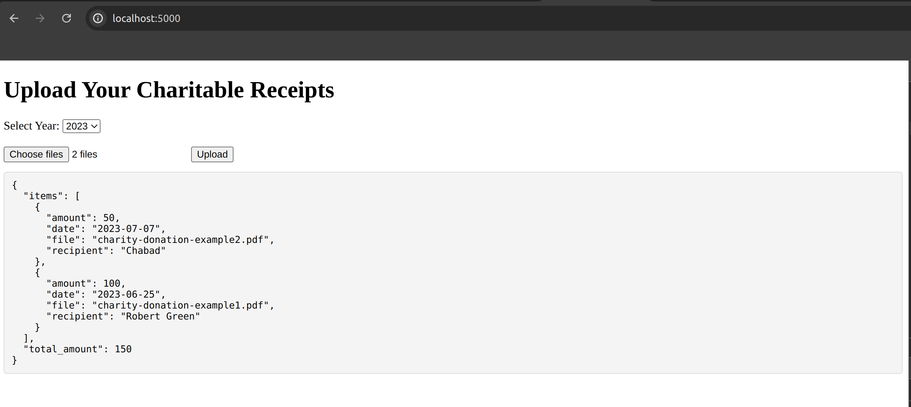

# Tax Receipt Extractor

## for a list of tax receipts in pdf format extract recipient, date, amount and sum the total



### Steps to run:

1. get your openai api key https://platform.openai.com/api-keys

2. create .env
    ```
    touch .env
    echo 'OPENAI_API_KEY=my-key' > .env
    ```

3. install
    ```
    pip install -r requirements.txt
    ```

4. run
    ```
    python app.py
    ```

5. navigate to http://localhost:5000